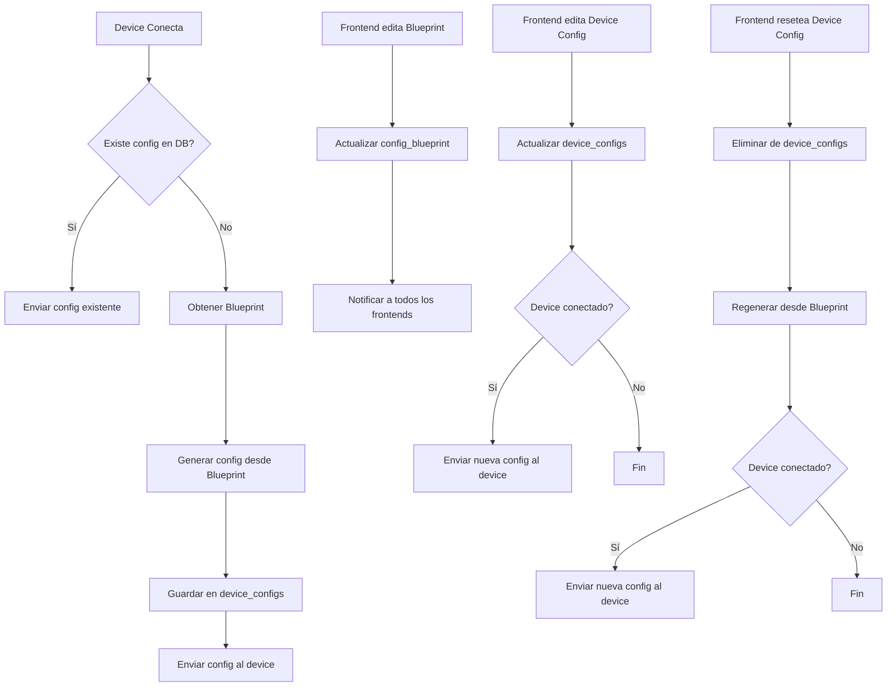

# Plan de Implementación: Sistema de Configuración por Device

## Resumen

Implementar un sistema de configuración específica para cada dispositivo Android basado en su UUID. El servidor tendrá una tabla "blueprint" con parámetros por defecto, y una tabla "device_configs" para almacenar la configuración de cada dispositivo. El frontend permitirá editar los valores del blueprint.

---

## Arquitectura Actual

### Estado Actual
- **Server**: Envía configuración hardcodeada a todos los dispositivos (server.js línea 152-157)
- **Android App**: Recibe config via evento "config_data" y la almacena localmente
- **Database**: Tablas `devices` y `device_daily_logs`
- **Frontend**: Selección de dispositivos, logs, screenshots, build de APK

### Configuración Actual del Device
```javascript
const defaultConfig = {
    server_url: 'https://android-portal.tunegociosmart.com.ar' + androidNamespace,
    screenshot_quality: 70,
    auto_screenshot: true
};
```

---

## Fase 1: Base de Datos

### 1.1 Tabla `config_blueprint`
Tabla que almacena los parámetros por defecto para todos los dispositivos.

```sql
CREATE TABLE IF NOT EXISTS config_blueprint (
    id INTEGER PRIMARY KEY AUTOINCREMENT,
    server_url TEXT NOT NULL,
    screenshot_quality INTEGER DEFAULT 70 CHECK(screenshot_quality >= 1 AND screenshot_quality <= 100),
    auto_screenshot INTEGER DEFAULT 1,  -- 0 = false, 1 = true
    created_at INTEGER DEFAULT (strftime('%s', 'now')),
    updated_at INTEGER DEFAULT (strftime('%s', 'now'))
);
```

**Campos:**
- `server_url`: URL del servidor para conexión del device
- `screenshot_quality`: Calidad de screenshot (1-100)
- `auto_screenshot`: Si el screenshot automático está habilitado
- `created_at`, `updated_at`: Timestamps de auditoría

### 1.2 Tabla `device_configs`
Tabla que almacena la configuración específica de cada dispositivo.

```sql
CREATE TABLE IF NOT EXISTS device_configs (
    id INTEGER PRIMARY KEY AUTOINCREMENT,
    device_uuid TEXT NOT NULL,
    server_url TEXT NOT NULL,
    screenshot_quality INTEGER DEFAULT 70 CHECK(screenshot_quality >= 1 AND screenshot_quality <= 100),
    auto_screenshot INTEGER DEFAULT 1,  -- 0 = false, 1 = true
    is_custom INTEGER DEFAULT 0,  -- 0 = from blueprint, 1 = manually modified
    created_at INTEGER DEFAULT (strftime('%s', 'now')),
    updated_at INTEGER DEFAULT (strftime('%s', 'now')),
    FOREIGN KEY (device_uuid) REFERENCES devices (device_uuid),
    UNIQUE(device_uuid)
);
```

**Campos:**
- `device_uuid`: UUID del dispositivo (FK a devices)
- `server_url`, `screenshot_quality`, `auto_screenshot`: Valores de configuración
- `is_custom`: Flag para indicar si la config fue modificada manualmente
- `created_at`, `updated_at`: Timestamps de auditoría

### 1.3 Inicialización del Blueprint
Insertar un registro por defecto en la tabla blueprint al iniciar el servidor:

```sql
INSERT OR IGNORE INTO config_blueprint (id, server_url, screenshot_quality, auto_screenshot) 
VALUES (1, 'https://android-portal.tunegociosmart.com.ar/android', 70, 1);
```

---

## Fase 2: Backend (Server)

### 2.1 Modificaciones en `server/db.js`

**Nuevas funciones:**

```javascript
// Obtener blueprint
db.getBlueprint = () => db.get('SELECT * FROM config_blueprint WHERE id = 1');

// Actualizar blueprint
db.updateBlueprint = (server_url, screenshot_quality, auto_screenshot) => 
    db.run('UPDATE config_blueprint SET server_url = ?, screenshot_quality = ?, auto_screenshot = ?, updated_at = ? WHERE id = 1',
        server_url, screenshot_quality, auto_screenshot ? 1 : 0, Date.now());

// Obtener config de un device
db.getDeviceConfig = (device_uuid) => 
    db.get('SELECT * FROM device_configs WHERE device_uuid = ?', device_uuid);

// Crear o actualizar config de device (basado en blueprint)
db.upsertDeviceConfig = (device_uuid, server_url, screenshot_quality, auto_screenshot, is_custom = 0) =>
    db.run(`INSERT OR REPLACE INTO device_configs 
            (device_uuid, server_url, screenshot_quality, auto_screenshot, is_custom, updated_at) 
            VALUES (?, ?, ?, ?, ?, ?)`,
        device_uuid, server_url, screenshot_quality, auto_screenshot ? 1 : 0, is_custom, Date.now());

// Obtener todas las configs de devices
db.getAllDeviceConfigs = () => db.all('SELECT * FROM device_configs');

// Eliminar config de un device
db.deleteDeviceConfig = (device_uuid) => 
    db.run('DELETE FROM device_configs WHERE device_uuid = ?', device_uuid);
```

### 2.2 Modificaciones en `server/server.js`

#### 2.2.1 Inicialización del Blueprint
Al iniciar el servidor, crear el blueprint por defecto si no existe:

```javascript
// Al inicio del archivo, después de importar db
async function initializeBlueprint() {
    try {
        const blueprint = await db.getBlueprint();
        if (!blueprint) {
            const defaultServerUrl = `https://android-portal.tunegociosmart.com.ar/android`;
            await db.run(
                'INSERT OR IGNORE INTO config_blueprint (id, server_url, screenshot_quality, auto_screenshot) VALUES (1, ?, ?, ?)',
                defaultServerUrl, 70, 1
            );
            console.log(chalk.green('[+] Blueprint initialized with default values'));
        }
    } catch (error) {
        console.error('Error initializing blueprint:', error);
    }
}

// Llamar después de crear la DB
initializeBlueprint();
```

#### 2.2.2 Generar Config desde Blueprint
Función para generar la configuración de un dispositivo basándose en el blueprint:

```javascript
async function generateDeviceConfig(deviceUuid) {
    try {
        // Verificar si ya existe config para este device
        let deviceConfig = await db.getDeviceConfig(deviceUuid);
        
        if (deviceConfig) {
            // Si existe, retornar la config existente
            return {
                server_url: deviceConfig.server_url,
                screenshot_quality: deviceConfig.screenshot_quality,
                auto_screenshot: deviceConfig.auto_screenshot === 1
            };
        }
        
        // Si no existe, generar desde blueprint
        const blueprint = await db.getBlueprint();
        if (!blueprint) {
            throw new Error('Blueprint not found');
        }
        
        // Guardar la nueva config en DB
        await db.upsertDeviceConfig(
            deviceUuid,
            blueprint.server_url,
            blueprint.screenshot_quality,
            blueprint.auto_screenshot,
            0 // is_custom = 0 (viene del blueprint)
        );
        
        console.log(chalk.blue(`[i] Generated config for device ${deviceUuid} from blueprint`));
        
        return {
            server_url: blueprint.server_url,
            screenshot_quality: blueprint.screenshot_quality,
            auto_screenshot: blueprint.auto_screenshot === 1
        };
    } catch (error) {
        console.error('Error generating device config:', error);
        // Fallback a config por defecto
        return {
            server_url: 'https://android-portal.tunegociosmart.com.ar/android',
            screenshot_quality: 70,
            auto_screenshot: true
        };
    }
}
```

#### 2.2.3 Modificar Conexión del Device
Reemplazar la configuración hardcodeada en el evento de conexión:

```javascript
// En androidIo.on("connection", async (socket) => { ... })
// Reemplazar líneas 152-158 con:

// Generar config específica para este device
const deviceConfig = await generateDeviceConfig(deviceUuid);
socket.emit("config_data", deviceConfig);
console.log(chalk.blue(`[i] Sent config to device ${deviceUuid}:`, JSON.stringify(deviceConfig)));
```

#### 2.2.4 Nuevos Eventos Socket.io para Frontend

**Evento: Obtener Blueprint**
```javascript
socket.on("get_blueprint", async () => {
    try {
        const blueprint = await db.getBlueprint();
        socket.emit("blueprint_data", blueprint || {
            server_url: 'https://android-portal.tunegociosmart.com.ar/android',
            screenshot_quality: 70,
            auto_screenshot: 1
        });
    } catch (error) {
        console.error('Error getting blueprint:', error);
        socket.emit("blueprint_error", { error: error.message });
    }
});
```

**Evento: Actualizar Blueprint**
```javascript
socket.on("update_blueprint", async (data) => {
    try {
        const { server_url, screenshot_quality, auto_screenshot } = data;
        
        // Validaciones
        if (!server_url || typeof server_url !== 'string') {
            throw new Error('Invalid server_url');
        }
        if (screenshot_quality < 1 || screenshot_quality > 100) {
            throw new Error('screenshot_quality must be between 1 and 100');
        }
        
        await db.updateBlueprint(server_url, screenshot_quality, auto_screenshot);
        
        console.log(chalk.green(`[+] Blueprint updated by frontend ${socket.id}`));
        socket.emit("blueprint_updated", { success: true });
        
        // Notificar a todos los frontends
        frontendIo.emit("blueprint_changed", {
            server_url,
            screenshot_quality,
            auto_screenshot
        });
    } catch (error) {
        console.error('Error updating blueprint:', error);
        socket.emit("blueprint_error", { error: error.message });
    }
});
```

**Evento: Obtener Config de un Device**
```javascript
socket.on("get_device_config", async (deviceUuid) => {
    try {
        const config = await db.getDeviceConfig(deviceUuid);
        if (config) {
            socket.emit("device_config_data", {
                device_uuid: deviceUuid,
                ...config,
                auto_screenshot: config.auto_screenshot === 1
            });
        } else {
            // Si no existe, generar desde blueprint
            const generatedConfig = await generateDeviceConfig(deviceUuid);
            socket.emit("device_config_data", {
                device_uuid: deviceUuid,
                ...generatedConfig,
                is_custom: 0
            });
        }
    } catch (error) {
        console.error('Error getting device config:', error);
        socket.emit("device_config_error", { error: error.message });
    }
});
```

**Evento: Actualizar Config de un Device (Fase 2)**
```javascript
socket.on("update_device_config", async (data) => {
    try {
        const { device_uuid, server_url, screenshot_quality, auto_screenshot } = data;
        
        // Validaciones
        if (!device_uuid) {
            throw new Error('device_uuid is required');
        }
        if (!server_url || typeof server_url !== 'string') {
            throw new Error('Invalid server_url');
        }
        if (screenshot_quality < 1 || screenshot_quality > 100) {
            throw new Error('screenshot_quality must be between 1 and 100');
        }
        
        // Actualizar config en DB
        await db.upsertDeviceConfig(
            device_uuid,
            server_url,
            screenshot_quality,
            auto_screenshot,
            1 // is_custom = 1 (modificada manualmente)
        );
        
        console.log(chalk.green(`[+] Config updated for device ${device_uuid} by frontend ${socket.id}`));
        socket.emit("device_config_updated", { success: true, device_uuid });
        
        // Si el device está conectado, enviarle la nueva config
        const device = devices.get(device_uuid);
        if (device && device.socket) {
            const newConfig = {
                server_url,
                screenshot_quality,
                auto_screenshot
            };
            device.socket.emit("config_data", newConfig);
            console.log(chalk.blue(`[i] Sent updated config to device ${device_uuid}`));
        }
    } catch (error) {
        console.error('Error updating device config:', error);
        socket.emit("device_config_error", { error: error.message });
    }
});
```

**Evento: Resetear Config de Device a Blueprint**
```javascript
socket.on("reset_device_config", async (deviceUuid) => {
    try {
        if (!deviceUuid) {
            throw new Error('device_uuid is required');
        }
        
        // Eliminar config personalizada
        await db.deleteDeviceConfig(deviceUuid);
        
        // Regenerar desde blueprint
        const newConfig = await generateDeviceConfig(deviceUuid);
        
        console.log(chalk.green(`[+] Config reset to blueprint for device ${deviceUuid}`));
        socket.emit("device_config_reset", { success: true, device_uuid: deviceUuid });
        
        // Si el device está conectado, enviarle la nueva config
        const device = devices.get(deviceUuid);
        if (device && device.socket) {
            device.socket.emit("config_data", newConfig);
            console.log(chalk.blue(`[i] Sent reset config to device ${deviceUuid}`));
        }
    } catch (error) {
        console.error('Error resetting device config:', error);
        socket.emit("device_config_error", { error: error.message });
    }
});
```

---

## Fase 3: Frontend

### 3.1 Modificaciones en `nginx/public/index.html`

#### 3.1.1 Agregar Tab de Configuración
Agregar un nuevo tab "Config" en la sección de tabs:

```html
<div id="tabs">
    <button class="tab-button active" onclick="showTab('logs')">Logs</button>
    <button class="tab-button" onclick="showTab('screenshots')">Screenshots</button>
    <button class="tab-button" onclick="showTab('config')">Config</button>
</div>
```

#### 3.1.2 Agregar Contenido del Tab de Configuración
Después del tab de screenshots, agregar:

```html
<div id="config-tab" class="tab-content">
    <div class="config-container">
        <!-- Sección Blueprint -->
        <div class="config-section">
            <h3>Blueprint (Default Config)</h3>
            <p class="config-description">These values are used as default for all new devices</p>
            
            <div class="config-form">
                <div class="config-field">
                    <label for="blueprint-server-url">Server URL:</label>
                    <input type="text" id="blueprint-server-url" placeholder="https://example.com/android">
                </div>
                
                <div class="config-field">
                    <label for="blueprint-screenshot-quality">Screenshot Quality (1-100):</label>
                    <input type="number" id="blueprint-screenshot-quality" min="1" max="100" value="70">
                </div>
                
                <div class="config-field">
                    <label for="blueprint-auto-screenshot">
                        <input type="checkbox" id="blueprint-auto-screenshot" checked>
                        Auto Screenshot Enabled
                    </label>
                </div>
                
                <div class="config-actions">
                    <button onclick="saveBlueprint()" class="config-button save">Save Blueprint</button>
                    <button onclick="loadBlueprint()" class="config-button reload">Reload</button>
                </div>
            </div>
        </div>
        
        <!-- Sección Device Config -->
        <div class="config-section" id="device-config-section" style="display: none;">
            <h3>Device Configuration</h3>
            <p class="config-description">Configuration for selected device: <span id="config-device-name">--</span></p>
            
            <div class="config-form">
                <div class="config-field">
                    <label for="device-server-url">Server URL:</label>
                    <input type="text" id="device-server-url" placeholder="https://example.com/android">
                </div>
                
                <div class="config-field">
                    <label for="device-screenshot-quality">Screenshot Quality (1-100):</label>
                    <input type="number" id="device-screenshot-quality" min="1" max="100" value="70">
                </div>
                
                <div class="config-field">
                    <label for="device-auto-screenshot">
                        <input type="checkbox" id="device-auto-screenshot" checked>
                        Auto Screenshot Enabled
                    </label>
                </div>
                
                <div class="config-field">
                    <label>Config Source:</label>
                    <span id="device-config-source">Blueprint</span>
                </div>
                
                <div class="config-actions">
                    <button onclick="saveDeviceConfig()" class="config-button save">Save Device Config</button>
                    <button onclick="resetDeviceConfig()" class="config-button reset">Reset to Blueprint</button>
                    <button onclick="loadDeviceConfig()" class="config-button reload">Reload</button>
                </div>
            </div>
        </div>
        
        <!-- Mensaje cuando no hay device seleccionado -->
        <div class="config-section" id="no-device-selected">
            <p class="config-message">Select a device to view/edit its configuration</p>
        </div>
    </div>
</div>
```

### 3.2 Modificaciones en `nginx/public/js/index.js`

#### 3.2.1 Variables Globales
```javascript
let currentBlueprint = null;
let currentDeviceConfig = null;
```

#### 3.2.2 Funciones de Blueprint

```javascript
// Cargar blueprint del servidor
function loadBlueprint() {
    socket.emit("get_blueprint");
}

// Guardar blueprint
function saveBlueprint() {
    const serverUrl = document.getElementById('blueprint-server-url').value.trim();
    const screenshotQuality = parseInt(document.getElementById('blueprint-screenshot-quality').value);
    const autoScreenshot = document.getElementById('blueprint-auto-screenshot').checked;
    
    if (!serverUrl) {
        showMsg('Please enter a valid Server URL');
        return;
    }
    
    if (screenshotQuality < 1 || screenshotQuality > 100) {
        showMsg('Screenshot Quality must be between 1 and 100');
        return;
    }
    
    socket.emit("update_blueprint", {
        server_url: serverUrl,
        screenshot_quality: screenshotQuality,
        auto_screenshot: autoScreenshot
    });
}

// Actualizar UI con datos del blueprint
function updateBlueprintUI(blueprint) {
    currentBlueprint = blueprint;
    document.getElementById('blueprint-server-url').value = blueprint.server_url || '';
    document.getElementById('blueprint-screenshot-quality').value = blueprint.screenshot_quality || 70;
    document.getElementById('blueprint-auto-screenshot').checked = blueprint.auto_screenshot === 1;
}
```

#### 3.2.3 Funciones de Device Config

```javascript
// Cargar config de un device
function loadDeviceConfig() {
    if (!currentDevice || currentDevice === 'None') {
        showMsg('Please select a device first');
        return;
    }
    socket.emit("get_device_config", currentDevice);
}

// Guardar config de un device
function saveDeviceConfig() {
    if (!currentDevice || currentDevice === 'None') {
        showMsg('Please select a device first');
        return;
    }
    
    const serverUrl = document.getElementById('device-server-url').value.trim();
    const screenshotQuality = parseInt(document.getElementById('device-screenshot-quality').value);
    const autoScreenshot = document.getElementById('device-auto-screenshot').checked;
    
    if (!serverUrl) {
        showMsg('Please enter a valid Server URL');
        return;
    }
    
    if (screenshotQuality < 1 || screenshotQuality > 100) {
        showMsg('Screenshot Quality must be between 1 and 100');
        return;
    }
    
    socket.emit("update_device_config", {
        device_uuid: currentDevice,
        server_url: serverUrl,
        screenshot_quality: screenshotQuality,
        auto_screenshot: autoScreenshot
    });
}

// Resetear config de device a blueprint
function resetDeviceConfig() {
    if (!currentDevice || currentDevice === 'None') {
        showMsg('Please select a device first');
        return;
    }
    
    if (confirm('Are you sure you want to reset this device configuration to blueprint defaults?')) {
        socket.emit("reset_device_config", currentDevice);
    }
}

// Actualizar UI con config del device
function updateDeviceConfigUI(config) {
    currentDeviceConfig = config;
    
    // Mostrar sección de device config
    document.getElementById('device-config-section').style.display = 'block';
    document.getElementById('no-device-selected').style.display = 'none';
    
    // Actualizar nombre del device
    const device = Array.from(devices.values()).find(d => d.ID === currentDevice);
    document.getElementById('config-device-name').textContent = device ? `${device.Brand} (${device.Model})` : currentDevice;
    
    // Actualizar campos
    document.getElementById('device-server-url').value = config.server_url || '';
    document.getElementById('device-screenshot-quality').value = config.screenshot_quality || 70;
    document.getElementById('device-auto-screenshot').checked = config.auto_screenshot === 1 || config.auto_screenshot === true;
    
    // Actualizar indicador de fuente
    const sourceElement = document.getElementById('device-config-source');
    if (config.is_custom === 1) {
        sourceElement.textContent = 'Custom';
        sourceElement.className = 'config-source custom';
    } else {
        sourceElement.textContent = 'Blueprint';
        sourceElement.className = 'config-source blueprint';
    }
}

// Ocultar sección de device config cuando no hay device seleccionado
function hideDeviceConfigUI() {
    document.getElementById('device-config-section').style.display = 'none';
    document.getElementById('no-device-selected').style.display = 'block';
    currentDeviceConfig = null;
}
```

#### 3.2.4 Eventos Socket.io

```javascript
// Recibir blueprint
socket.on("blueprint_data", (blueprint) => {
    updateBlueprintUI(blueprint);
});

// Blueprint actualizado
socket.on("blueprint_updated", (data) => {
    if (data.success) {
        showMsg('Blueprint saved successfully');
        loadBlueprint(); // Recargar para confirmar
    }
});

// Blueprint cambiado (notificación a otros frontends)
socket.on("blueprint_changed", (blueprint) => {
    updateBlueprintUI(blueprint);
    showMsg('Blueprint was updated by another session');
});

// Recibir config de device
socket.on("device_config_data", (config) => {
    updateDeviceConfigUI(config);
});

// Config de device actualizada
socket.on("device_config_updated", (data) => {
    if (data.success) {
        showMsg('Device configuration saved successfully');
        loadDeviceConfig(); // Recargar para confirmar
    }
});

// Config de device reseteada
socket.on("device_config_reset", (data) => {
    if (data.success) {
        showMsg('Device configuration reset to blueprint');
        loadDeviceConfig(); // Recargar para confirmar
    }
});

// Error en operaciones de config
socket.on("blueprint_error", (data) => {
    showMsg('Blueprint error: ' + data.error);
});

socket.on("device_config_error", (data) => {
    showMsg('Device config error: ' + data.error);
});
```

#### 3.2.5 Modificar Función `getInfo`
Agregar carga de config del device cuando se selecciona:

```javascript
async function getInfo(id) {
    previousDevice = currentDevice;
    currentDevice = (typeof id === 'string' ? id.trim() : id);
    console.log('Selected device id:', id, 'currentDevice set to:', currentDevice);

    if (id != "None") {
        socket.emit("get_device_info", id);
        // Cargar config del device si estamos en el tab de config
        if (document.getElementById('config-tab').classList.contains('active')) {
            loadDeviceConfig();
        }
    } else {
        currentDevice = "";
        previousDevice = "";
        infos.innerHTML = '<div class="info">    <span>Brand :</span>    <span>--</span></div><div class="info">    <span>Model :</span>    <span>--</span></div><div class="info">    <span>Manufacture :</span>    <span>--</span></div><div class="device-action"><div class="screenshot-button" onclick="takeScreenshot()" title="Take Screenshot"><span>Take Screenshot</span></div></div>';
        output.value = "";
        updateScreenshotButton();
        if (document.getElementById('screenshots-tab').classList.contains('active')) {
            updateScreenshotsGallery([]);
        }
        // Ocultar config de device
        hideDeviceConfigUI();
    }
}
```

#### 3.2.6 Modificar Función `showTab`
Agregar carga de datos cuando se muestra el tab de config:

```javascript
function showTab(tabName) {
    // Hide all tabs
    document.querySelectorAll('.tab-content').forEach(tab => {
        tab.classList.remove('active');
    });

    // Remove active class from all buttons
    document.querySelectorAll('.tab-button').forEach(button => {
        button.classList.remove('active');
    });

    // Show selected tab
    document.getElementById(tabName + '-tab').classList.add('active');
    event.target.classList.add('active');

    // Load data based on tab
    if (tabName === 'screenshots') {
        loadScreenshots();
    } else if (tabName === 'config') {
        loadBlueprint();
        if (currentDevice && currentDevice !== 'None') {
            loadDeviceConfig();
        } else {
            hideDeviceConfigUI();
        }
    }
}
```

#### 3.2.7 Inicialización
Agregar carga inicial del blueprint:

```javascript
$(document).ready(() => {
    // Initialize nice-select
    $("select").niceSelect()

    // Initialize screenshot button state
    updateScreenshotButton()
    
    // Load blueprint on startup
    loadBlueprint()
})
```

### 3.3 Modificaciones en `nginx/public/css/index.css`

Agregar estilos para el tab de configuración:

```css
/* Config Tab Styles */
.config-container {
    padding: 1rem;
    height: 100%;
    overflow-y: auto;
}

.config-section {
    background-color: #ffffff;
    border-radius: 8px;
    padding: 1.5rem;
    margin-bottom: 1rem;
    box-shadow: 0 2px 4px rgba(0, 0, 0, 0.1);
}

.config-section h3 {
    margin: 0 0 0.5rem 0;
    color: #333;
    font-size: 1.2rem;
}

.config-description {
    color: #666;
    font-size: 0.9rem;
    margin: 0 0 1rem 0;
}

.config-form {
    display: flex;
    flex-direction: column;
    gap: 1rem;
}

.config-field {
    display: flex;
    flex-direction: column;
    gap: 0.5rem;
}

.config-field label {
    font-weight: 500;
    color: #333;
    font-size: 0.9rem;
}

.config-field input[type="text"],
.config-field input[type="number"] {
    padding: 0.5rem;
    border: 1px solid #ddd;
    border-radius: 4px;
    font-size: 1rem;
}

.config-field input[type="text"]:focus,
.config-field input[type="number"]:focus {
    outline: none;
    border-color: #007bff;
    box-shadow: 0 0 0 2px rgba(0, 123, 255, 0.25);
}

.config-field input[type="checkbox"] {
    width: 18px;
    height: 18px;
    cursor: pointer;
}

.config-actions {
    display: flex;
    gap: 0.5rem;
    margin-top: 0.5rem;
}

.config-button {
    padding: 0.5rem 1rem;
    border: none;
    border-radius: 4px;
    cursor: pointer;
    font-size: 0.9rem;
    font-weight: 500;
    transition: background-color 0.2s;
}

.config-button.save {
    background-color: #28a745;
    color: white;
}

.config-button.save:hover {
    background-color: #218838;
}

.config-button.reload {
    background-color: #6c757d;
    color: white;
}

.config-button.reload:hover {
    background-color: #5a6268;
}

.config-button.reset {
    background-color: #ffc107;
    color: #333;
}

.config-button.reset:hover {
    background-color: #e0a800;
}

.config-source {
    display: inline-block;
    padding: 0.25rem 0.5rem;
    border-radius: 4px;
    font-size: 0.85rem;
    font-weight: 500;
}

.config-source.blueprint {
    background-color: #17a2b8;
    color: white;
}

.config-source.custom {
    background-color: #6f42c1;
    color: white;
}

.config-message {
    text-align: center;
    color: #666;
    padding: 2rem;
    font-style: italic;
}

/* Responsive adjustments */
@media (max-width: 768px) {
    .config-actions {
        flex-direction: column;
    }
    
    .config-button {
        width: 100%;
    }
}
```

---

## Fase 4: Testing

### 4.1 Casos de Prueba

1. **Inicialización del Blueprint**
   - Verificar que se crea el blueprint por defecto al iniciar el servidor
   - Verificar que los valores por defecto son correctos

2. **Conexión de Nuevo Device**
   - Conectar un nuevo device
   - Verificar que recibe la configuración del blueprint
   - Verificar que se crea un registro en `device_configs`

3. **Edición de Blueprint**
   - Modificar valores del blueprint desde el frontend
   - Verificar que se guardan correctamente en la DB
   - Verificar que los cambios se reflejan en el frontend

4. **Config de Device desde Blueprint**
   - Seleccionar un device en el frontend
   - Verificar que muestra la config del blueprint
   - Verificar que el indicador muestra "Blueprint"

5. **Edición de Config de Device (Fase 2)**
   - Modificar la config de un device específico
   - Verificar que se guarda como "Custom"
   - Verificar que el device recibe la nueva config

6. **Reset de Config de Device**
   - Resetear la config de un device a blueprint
   - Verificar que se elimina la config personalizada
   - Verificar que el device recibe la config del blueprint

---

## Orden de Implementación

### Paso 1: Database
1. Modificar `server/db.js` para agregar las nuevas tablas
2. Agregar las funciones de acceso a datos

### Paso 2: Backend
1. Modificar `server/server.js`:
   - Agregar inicialización del blueprint
   - Agregar función `generateDeviceConfig`
   - Modificar la conexión del device para usar config dinámica
   - Agregar eventos Socket.io para blueprint y device config

### Paso 3: Frontend
1. Modificar `nginx/public/index.html`:
   - Agregar tab de configuración
   - Agregar formularios para blueprint y device config

2. Modificar `nginx/public/js/index.js`:
   - Agregar funciones de manejo de blueprint
   - Agregar funciones de manejo de device config
   - Agregar eventos Socket.io
   - Modificar funciones existentes para integrar la nueva funcionalidad

3. Modificar `nginx/public/css/index.css`:
   - Agregar estilos para el tab de configuración

### Paso 4: Testing
1. Probar todos los casos de prueba
2. Ajustar según sea necesario

---

## Notas Importantes

1. **Backward Compatibility**: El sistema mantiene compatibilidad con dispositivos existentes. Si un device ya tiene config guardada, se usará esa. Si no, se generará desde el blueprint.

2. **Validaciones**: Todas las entradas son validadas tanto en frontend como en backend.

3. **Sincronización**: Los cambios en el blueprint se notifican a todos los frontends conectados.

4. **Fase 2**: La funcionalidad de modificar config individual de device está preparada pero puede implementarse en una segunda fase.

5. **Fallback**: Si hay algún error, se usa una configuración por defecto hardcodeada como fallback.

---

## Diagrama de Flujo



---

## Resumen de Archivos a Modificar

1. **server/db.js** - Agregar tablas y funciones de acceso a datos
2. **server/server.js** - Agregar lógica de configuración dinámica
3. **nginx/public/index.html** - Agregar tab de configuración
4. **nginx/public/js/index.js** - Agregar funciones de manejo de config
5. **nginx/public/css/index.css** - Agregar estilos para config

---

## Próximos Pasos (Fase 2)

1. Implementar edición individual de config por device
2. Agregar historial de cambios de configuración
3. Agregar exportación/importación de configuraciones
4. Agregar templates de configuración predefinidos
5. Agregar validación de URLs en tiempo real
